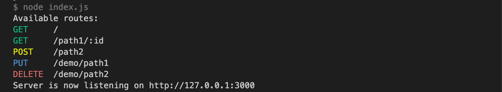

A simple plugin for Fastify list all available routes.

## Installation

```base
npm i fastify-list-routes
```

```base
yarn add fastify-list-routes
```

## Usage

Try to register a plugin as early as possible before register routes.

- `colors`: If to use colors to highlight routes.

## Example

```js
const fastify = require("fastify")();
const fastifyListRoutes = require("fastify-list-routes");

async function run() {
  await fastify.register(fastifyListRoutes, { colors: true });

  fastify.get("/", (request, reply) => {
    reply.send({ hello: "world" });
  });

  fastify.get("/path1/:id", {
    async handler() {
      return { ok: true };
    },
  });

  fastify.post("/path2", {
    async handler() {
      return { ok: true };
    },
  });

  fastify.register(require("./demo"), { prefix: "/demo" });

  fastify.listen({ port: 3000 }, (err, address) => {
    if (err) throw err;

    console.log(`Server is now listening on ${address}`);
  });
}
run();
```

Result when started successfully



## License

MIT
